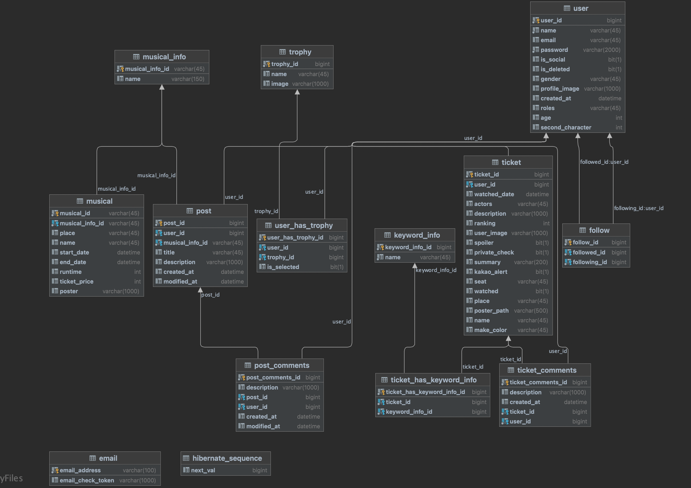
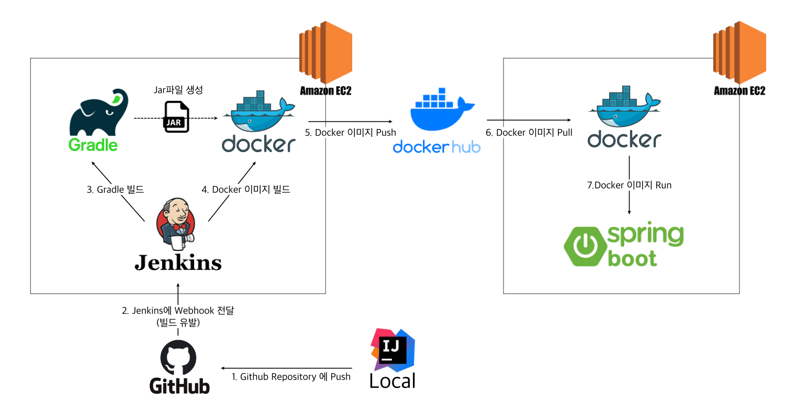

# PostMission Server

## 프로젝트 소개


## 설치 및 구동 방법

```
git clone https://github.com/post-mission/backend.git
./gradlew build
java -jar [snapshot.jar]
```

### application.yml

> 보안상의 이유로 아래 파일은 빼놓고 소스코드를 올려 두었습니다. 아래 파일을 `src > main > resources` 밑에 추가해주시고 실행해주시면 됩니다.

* [application.yml sample](./files/application-yml.md)
* [application-aws.yml sample](./files/application-aws-yml.md)

## erd diagram



## 총 4회에 걸쳐 jpa 스터디 진행

* [jpa 스터디 1차](./files/jpa-study-1차.md)
  * jpa의 동작원리 및 영속성 컨텍스트
* [jpa 스터디 2차](./files/jpa-study-2차.md)
  * 연관관계 mapping과 다양한 annotation
* [jpa 스터디 3차](./files/jpa-study-3차.md)
  * proxy와 지연로딩. N+1문제
* [jpa 스터디 4차](./files/jpa-study-4차.md)
  * Spring data jpa

## 서버 배포 구조



* [출처 블로그](https://velog.io/@haeny01/AWS-Jenkins%EB%A5%BC-%ED%99%9C%EC%9A%A9%ED%95%9C-Docker-x-SpringBoot-CICD-%EA%B5%AC%EC%B6%95)

## 이번 프로트에서의 기술적 목표

1. 회원 인증(소셜 로그인, JWT) : spring security
2. open api에서 받아오는 다량의 데이터 저장 및 필요 데이터 반환
3. open api 데이터 갱신 자동화 : spring batch, quartz
4. 배포 및 배포 자동화 : nginx, jenkins, docker
5. 회원 추천 시스템

## 팀원 및 역할 분담

1. 강동석

* quartz를 이용한 open api 자동 갱신 
* 게시판 및 티켓 관련 api 개발

2. 배용한

* 뮤지컬 정보 open api data 파싱 및 저장, 관리
* 티켓 관련 api 개발

3. 임형준

* 회원 인증 처리 (spring security, 소셜 로그인)
* 배포 관리


